# Cost Hamiltonian (`H_C`)

This document records the design of the **cost Hamiltonian** `H_C` — the object
that ties the classical QUBO to the quantum QAOA circuit. It is produced by
[`src/qubo.py`](../src/qubo.py) (`qubo_to_cost_hamiltonian` → `qubo.CostHamiltonian`)
and consumed by [`src/qaoa.py`](../src/qaoa.py), [`src/qaoa_nexus.py`](../src/qaoa_nexus.py),
and [`src/benchmark.py`](../src/benchmark.py).

For the *modeling* decisions behind the QUBO itself (objective sense, weight
scheme, penalties) see [`docs/qubo.md`](qubo.md); this document focuses on the
`QUBO → Ising → H_C` chain and how the resulting operator is used.

## 1. From QUBO to a diagonal Ising operator

The QUBO cost `cost(x) = Σ_i Q_ii·x_i + Σ_{i<j} Q_ij·x_i·x_j + offset` is mapped
to spin variables with `x_i = (1 − z_i)/2` (`z_i ∈ {−1, +1}`), yielding the Ising
form and, one-to-one, the cost Hamiltonian:

```
H_C = offset·I + Σ_i h_i·Z_i + Σ_{i<j} J_ij·Z_i·Z_j
```

Because the QUBO is quadratic, every term is a product of **at most two** `Z`
operators, so `H_C` is **diagonal** in the computational basis — no `X`/`Y`
factors. Its diagonal entry for a bitstring is exactly the QUBO cost of that
assignment, so **the ground state of `H_C` is the optimal fault-zone partition**.
The three forms share a single spin mapping, so `QUBO.energy`,
`CostHamiltonian.energy`, and the classical brute force all agree bit-for-bit.



## 2. `CostHamiltonian` structure

`qubo.CostHamiltonian` (defined at [`src/qubo.py:382`](../src/qubo.py)) is the
serializable carrier of the operator. It stores:

| Field | Meaning |
| ----- | ------- |
| `n_qubits` | number of substation nodes (one qubit per node) |
| `variables` | node ids in **qubit order** (sorted node-id order) |
| `terms` | list of `PauliZTerm` (`coefficient` × `Z` over `qubits`) |
| `offset` | constant energy shift (global phase for the circuit) |

Convenience views make it directly consumable without re-deriving the maps:

- **`z_terms`** → `(i, h_i)` for the single-`Z` fields.
- **`zz_terms`** → `(i, j, J_ij)` for the `Z_iZ_j` couplings.
- **`energy(assignment)`** → exact classical cost of a bit assignment (dict or
  list), matching `QUBO.energy`.
- **`guppy_terms()`** → plain int/float lists (`fields`, `couplings`, `offset`)
  ready for a Guppy kernel.

The whole operator is serialized into the `cost_hamiltonian` section of
[`data/qubo_cr.json`](../data/qubo_cr.json), so downstream code never has to
re-run the graph/QUBO stages to obtain `H_C`.

## 3. Mapping `H_C` to a QAOA circuit

The QAOA phase-separation unitary is `e^{−iγ·H_C}`. For a diagonal `H_C` this
factors into commuting single- and two-qubit `Z` rotations:

| Cost-Hamiltonian term | Circuit fragment |
| --------------------- | ---------------- |
| `h_i·Z_i`             | `rz(2·γ·h_i, i)` |
| `J_ij·Z_i·Z_j`        | `cx(i, j); rz(2·γ·J_ij, j); cx(i, j)` |
| `offset·I`            | global phase — ignored |

`guppy_terms()` returns exactly the `(i, coeff)` / `(i, j, coeff)` tuples this
mapping needs. The mixer layer (`rx(2·β)` per qubit) and the γ/β optimization
live in the QAOA solver — see [`docs/qaoa.md`](qaoa.md).

## 4. Same `H_C`, classical evaluation

The diagonal structure is also what lets the **classical** baselines score the
*full* QUBO objective. `qubo.augmented_ising_graph(H_C)` builds a weighted
Max-Cut graph — a `FIELD` node connected to variable `i` with weight `h_i`, plus
`J_ij` edges between variables — whose **maximum cut equals minimizing** `⟨H_C⟩`.
The `FIELD` node fixes the `z = +1` gauge, and `bits_from_partition` maps a cut
back to QUBO bits (`x = 0` on the `FIELD` side). This is how greedy and
Goemans-Williamson optimize the same operator QAOA does — see
[`docs/optimizers.md`](optimizers.md).

## 5. Exact spectrum for scoring

Because `H_C` is diagonal, its full spectrum is just the `2^n` diagonal entries.
`qaoa.brute_force_ground_state` / `qaoa.energy_bounds` and the timeout-guarded
`benchmark.brute_force_baseline` all delegate to the single vectorized cut
enumerator (`brute_force.enumerate_cut_spectrum`) to get the exact `(E_min, E_max)`,
which anchor the offset-robust **approximation ratio**
`r = (E_max − E) / (E_max − E_min)` used to compare every solver on the same
instance. Enumeration is capped at 26 qubits (`energy_bounds(max_qubits=26)`);
beyond that a Goemans-Williamson proxy provides the bounds.
