# Optimizers

This document records the design of **every optimizer** in the project and how
they are compared head-to-head. There are two families:

- **Classical Max-Cut baselines** — brute force, greedy, and Goemans-Williamson,
  in [`src/classical_baselines.py`](../src/classical_baselines.py) and their
  sampling wrappers in [`src/benchmark.py`](../src/benchmark.py).
- **QAOA** — the quantum solver in [`src/qaoa.py`](../src/qaoa.py) (local Selene)
  and [`src/qaoa_nexus.py`](../src/qaoa_nexus.py) (Nexus Helios). Its internal
  design is documented separately in [`docs/qaoa.md`](qaoa.md); this doc covers
  how it participates in the comparison.

All optimizers score the **same** fault-zone objective — the cost Hamiltonian
`H_C` from [`docs/hamiltonian.md`](hamiltonian.md) — so their results are directly
comparable via the approximation ratio.



## 1. Common objective and score

Every solver ultimately produces one or more bit assignments, each scored by
`CostHamiltonian.energy` as `⟨H_C⟩`. To compare solvers with different signs and
offsets fairly, each energy is rescaled onto `[0, 1]` against the exact spectrum
bounds `(e_min, e_max)`:

```
r = (e_max − E) / (e_max − e_min)
```

`r = 1` is the classical optimum, higher is better
(`qaoa.approximation_ratio`). The bounds come from the **baseline** (§5).

The classical baselines optimize Max-Cut, not `⟨H_C⟩`, directly. To make them
optimize the *full* QUBO objective, `benchmark.augmented_ising_graph` turns `H_C`
into a weighted Max-Cut graph whose maximum cut equals minimizing `⟨H_C⟩` (see
[`docs/hamiltonian.md` §4](hamiltonian.md)). The greedy/GW samplers therefore run
on that augmented graph and map partitions back with `bits_from_partition`.

## 2. Brute force (exact optimum / reference)

**Design.** The exact optimum by exhaustive enumeration of all `2^n`
assignments. Two implementations exist:

- `classical_baselines.brute_force_maxcut` — a simple reference for the plain
  Max-Cut value on the project graph (capped at 22 nodes).
- `benchmark.brute_force_baseline` — the **vectorized, timeout-guarded** version
  used by the evaluation. It enumerates `2^n` in chunks (`chunk_bits = 18`),
  decodes each chunk to `z ∈ {+1, −1}` columns, accumulates the energy with a
  Python loop **over the (few) Hamiltonian terms** rather than a dense
  `chunk × n_terms` product, and uses `float32`. That keeps peak memory
  proportional to the chunk size, so it scales to the 26-qubit grid (~216 s,
  under the 300 s default timeout).

**Why a timeout + fallback.** `2^n` growth is unavoidable, so an always-on
timeout (`BRUTE_FORCE_TIMEOUT_S = 300`) guards it. On timeout the enumeration
aborts and a Goemans-Williamson proxy supplies `(e_min, e_max)` instead
(`gw_baseline`), keeping the approximation ratio defined (but approximate).



Brute force is run **once per grid** (not per shot / iteration) and is the
baseline all other solvers are scored against.

## 3. Greedy (heuristic)

**Design.** `classical_baselines.greedy_maxcut` visits nodes in a seeded random
order and places each node on the side that maximizes the immediate cut gain
versus its already-placed neighbors. It is fast, deterministic given a seed, and
a weak-but-honest lower bar.

**As a sampler.** `benchmark.greedy_samples(ch, n_shots, seed)` runs `n_shots`
independent restarts (seed `+ s` each) on the augmented Ising graph, giving a
distribution of `n_shots` energies — the same sample budget as QAOA shots, so the
histograms and box plots compare like with like.



## 4. Goemans-Williamson (SDP relaxation)

**Design.** `classical_baselines.goemans_williamson` solves the classic SDP
relaxation `max Σ W_ij(1 − X_ij)/2` s.t. `diag(X) = 1`, `X ⪰ 0` (via `cvxpy` +
SCS), factors `X = V Vᵀ`, and rounds with random hyperplanes. It is the strongest
classical baseline and carries the well-known `0.878` approximation guarantee for
non-negative weights.

**As a sampler.** `benchmark.gw_samples(ch, n_shots, seed)` solves the SDP
**once** and then performs `n_shots` independent hyperplane roundings, so the
expensive convex solve is amortized across all shots. The best rounding is the GW
value; when brute force times out, GW's min/max double as the baseline bounds.



## 5. QAOA (quantum, p = 1…6)

The quantum optimizer's internals — the weighted Guppy 0.21 phase/mixer kernel,
the Guppy angle-unit handling, the naive and SciPy (COBYLA) optimizers, and the
Selene-vs-Nexus execution split — are documented in [`docs/qaoa.md`](qaoa.md).
Here is only how it plugs into the comparison:

- **Execution.** In the benchmark, QAOA runs COBYLA on the **Nexus Helios-1E-lite
  emulator** (`benchmark.solve_scipy_helios`). Every objective evaluation compiles
  the kernel for the current `(γ, β)`, submits **one Nexus job**, waits, and
  decodes `⟨H_C⟩`.
- **Per-iteration logging.** Each iteration's job reference is retained (and saved
  under `experiments/refs/`) and its shot counts kept, so the full per-shot
  distribution of every iteration is recoverable from the Nexus job results — this
  is what powers the convergence plots.
- **"Samples".** A QAOA record's per-shot energies are those of its **best**
  (lowest `⟨H_C⟩`) iteration, so it is scored on the same `n_shots`-sized
  distribution as greedy/GW.


## 6. Comparative evaluation harness

[`src/benchmark.py`](../src/benchmark.py) drives the comparison; it powers
[`notebooks/evaluation.ipynb`](../notebooks/evaluation.ipynb). Like
`src/qaoa_nexus.py`, it is **experiment support code** — it needs network +
`qnx.login()` for the QAOA path and is intentionally kept out of the reproducible
pipeline and the test suite. The offline pieces (graph growth, brute force,
classical samplers, metrics) are pure and unit-testable.



### 6.1 Growing grids

`grow_cost_hamiltonians` builds one `CostHamiltonian` per target size. Grids grow
from the 9-node `graph.GUANACASTE_NORTH` baseline by BFS-adding the adjacent real
substation with the highest weighted degree (deterministic alphabetical
tie-break), staying connected. Default sizes are `[9, 15, 26]`.

### 6.2 Configurable sweep and replicate runs

The experiment matrix is config-driven (edit the constants or pass arguments):

| Constant | Default | Meaning |
| -------- | ------- | ------- |
| `GRAPH_SIZES` | `[9, 15, 26]` | grid sizes (growing) |
| `P_VALUES` | `[1, 3, 6]` | QAOA layer counts |
| `SHOTS_LIST` | `[5000]` | shots / classical samples per config |
| `MAXITER_LIST` | `[100]` | COBYLA `maxiter` per config |
| `N_RUNS` | `3` | independent replicate runs per config |
| `DEVICE` | `Helios-1E-lite` | Nexus emulator |
| `BRUTE_FORCE_TIMEOUT_S` | `300` | brute-force cutoff → GW fallback |
| `MAX_WORKERS` | `8` | parallel workers |

`build_tasks` builds the full cross-product **× `N_RUNS`**, each replicate using an
independent seed (`seed + run·10_000`). Classical greedy/GW depend only on
`(size, shots)`; QAOA on `(size, p, shots, max_iter)`. Replicates give QAOA a
statistically meaningful mean/std that a single run cannot.

### 6.3 Parallel execution — await all before analysis

`compute_baselines` and `run_all` use a `ThreadPoolExecutor` and call `wait(...)`
to **block until every task finishes** before any metric is computed, so the
notebook never analyzes a partial result set. Failed tasks are reported and
skipped rather than aborting the batch.

### 6.4 Metrics and figures

- `summarize` → one tidy row **per replicate run** (mean/std energy, MSE vs.
  `e_min`, mean/best approximation ratio, time).
- `aggregate_runs` → **run-level mean ± std per configuration** (time, best
  energy, MSE, approximation ratio) — the statistically meaningful table.
- Figures in the notebook: per-iteration **energy distribution histograms** per
  optimizer, **approximation-ratio box plots** (one box per optimizer, pooled
  across a p-combination for QAOA), and **approximation-ratio convergence** curves
  (from the logged per-shot/per-iteration history).
- `save_results` persists raw records, baselines, and both tables to
  `experiments/results/*.json`.

## 7. Summary

| Optimizer | Kind | Guarantee | Sample budget | Cost |
| --------- | ---- | --------- | ------------- | ---- |
| Brute force | exact | optimal | 1 (per grid) | `O(2^n)`, timeout-guarded |
| Greedy | heuristic | none | `n_shots` restarts | cheap |
| Goemans-Williamson | SDP + rounding | `0.878` (non-neg.) | `n_shots` roundings | 1 SDP solve |
| QAOA `p` | variational quantum | heuristic | `n_shots` per iteration | 1 Nexus job / eval |
