# QAOA solver (Task C)

This document records the design decisions behind [`src/qaoa.py`](../src/qaoa.py),
which runs the **Quantum Approximate Optimization Algorithm (QAOA)** — written in
[Guppy](https://github.com/CQCL/guppylang) **0.21** and executed on the
[Selene](https://github.com/CQCL/selene) emulator — on the diagonal cost
Hamiltonian `H_C` produced by [`src/qubo.py`](../src/qubo.py).

The reference for the Guppy/Selene API and the variational-loop shape is
Quantinuum's [`qaoa_maxcut_example.ipynb`](https://github.com/Quantinuum/guppylang/blob/guppylang-0.21/examples/qaoa_maxcut_example.ipynb)
(branch `guppylang-0.21`). **Our problem is not the notebook's problem**, so the
kernel and energy evaluation are generalized — see §2.

Run it with (loads `data/qubo_cr.json`, or rebuilds `H_C` from
`data/grid_cr.json` if the QUBO file is missing):

```bash
python -m src.qaoa
```



## 1. What is fixed by the Graph + QUBO (no decision needed)

Everything the *quantum operator* needs is already determined by the pipeline and
serialized into [`data/qubo_cr.json`](../data/qubo_cr.json) as the
`cost_hamiltonian` section (`qubo.CostHamiltonian`):

- **Number of qubits** = number of substation nodes (currently **9**), one binary
  variable `x_i ∈ {0, 1}` per node (the fault-zone side it belongs to).
- **Cost Hamiltonian**
  `H_C = offset·I + Σ_i h_i·Z_i + Σ_{i<j} J_ij·Z_i·Z_j` — the single-`Z` fields
  `h_i`, the `Z_iZ_j` couplings `J_ij`, and the constant `offset`, obtained from
  the QUBO→Ising map (`x_i = (1 − z_i)/2`).
- **Optimization sense.** The QUBO is built with `maximize_cut=False`
  (minimize-cut + penalties, see [`docs/qubo.md`](qubo.md)), so the *signs* are
  already baked into `h_i`/`J_ij`. QAOA therefore **minimizes** `⟨H_C⟩`. This is
  the **opposite** of the max-cut notebook, which *maximizes* an unweighted
  energy.

So: the operator, its qubit count, and even the minimize-vs-maximize direction
are *not* free choices — they fall out of the Graph and QUBO.

## 2. Why we cannot copy the example kernel verbatim

The notebook solves **unweighted, field-free** max-cut:

- its phase layer is a bare `zz_phase` per edge (all edges identical weight), and
- its energy is a simple edge-XOR count.

Our `H_C` is **weighted** and has **single-`Z` fields** (from the linear QUBO
terms + penalties). We therefore follow the mapping already documented in
[`docs/qubo.md` §5](qubo.md), applying a *weighted* `rz` per field and a
*weighted* `cx; rz; cx` per coupling:

| Cost-Hamiltonian term | Circuit fragment                         |
| --------------------- | ---------------------------------------- |
| `h_i·Z_i`             | `rz(2·γ·h_i, i)`                          |
| `J_ij·Z_i·Z_j`        | `cx(i, j); rz(2·γ·J_ij, j); cx(i, j)`     |
| mixer                 | `rx(2·β, i)` per qubit                    |
| `offset·I`            | global phase — ignored                   |

Energy is evaluated as the true expectation `⟨H_C⟩` via
`CostHamiltonian.energy(bitstring)` weighted by shot probabilities (not the
example's XOR).

### Guppy 0.21 angle-unit gotcha

In guppy 0.21, `angle(x)` means `x` **half-turns** (`x·π` radians), and
`pi == angle(1)` — *not* radians. To keep the literal `rz(2·γ·h_i)` **radian**
convention above, each coefficient `2·h_i` (and the mixer's `2`) is folded with a
`1/π` factor **at compile time** into half-turns, so `γ` and `β` stay plain
multipliers. The single-`Z`/`Z_iZ_j` coefficients are baked into the kernel as
`comptime` constants (like the example's `edges`).

> Guppy cannot type-infer an *empty* `comptime` list, so a Hamiltonian with no
> field terms (or no couplings) would fail to compile. `build_qaoa_instance`
> injects a single zero-coefficient placeholder in that case; `rz(0)` and
> `cx; rz(0); cx` are exact identities, so the circuit is unchanged.

## 3. Decisions the algorithm still needs (hyperparameters)

These are genuine choices, *not* derivable from the Graph/QUBO:

| Hyperparameter | Default | Notes |
| -------------- | ------- | ----- |
| `p` (layers)   | `2`     | cost/mixer layer count |
| `n_shots`      | `1000`  | emulator shots per expectation value |
| `seed`         | `7`     | fixed for reproducible runs (repo convention) |
| `maxiter`      | `40` | SciPy iterations |
| initial params | seeded RNG | `[cost(p), mixer(p)]` half-turn multipliers |

### Classical optimizer

- **`solve_scipy`** — minimize `⟨H_C⟩` with SciPy **COBYLA** over
  the flattened `[cost(p), mixer(p)]` parameters. Every emulator run reuses the
  same fixed `seed`, so the objective is deterministic.

## 6. Running on Quantinuum Nexus (cloud emulator)

The Guppy kernel is **backend-agnostic**. `build_qaoa_instance` compiles to HUGR,
and Nexus executes HUGR directly on its hosted **Selene emulator**
(`qnexus.SeleneConfig` with a `StatevectorSimulator` — the cloud twin of the local
`Quest` engine). A HUGR execute job returns a `QsysResult`, the *same* type the
local `main.emulator(...).run()` returns, so `energy_from_result` and `QAOAResult`
decode the counts **unchanged**. The only difference is the run call:

| Local Selene (`src.qaoa`) | Nexus (`src.qaoa_nexus`) |
| ------------------------- | ------------------------ |
| `main.emulator(...).run()` | `qnx.hugr.upload` → `qnx.start_execute_job` (SeleneConfig) → `qnx.jobs.wait_for` → `download_result` |

[`src/qaoa_nexus.py`](../src/qaoa_nexus.py) provides `login`, `get_project`,
`selene_config`, `eval_qaoa_energy_nexus`, and `solve_scipy_nexus` (same signature
shape as `solve_scipy`, returning the standard `QAOAResult`). It is an **experiment
script**: it needs network + an interactive `qnx.login()` and submits one cloud job
per objective evaluation, so — per `skills/qnexus/SKILL.md` — it is kept out of the
test suite and the reproducible pipeline. The actual optimization run lives in
[`notebooks/nexus_optimization.ipynb`](../notebooks/nexus_optimization.ipynb) (not a
functional-validation notebook — that is `notebooks/validation.ipynb`). No new
modeling decisions are required beyond the Nexus **project name** and the emulator
config (simulator seed and optional `error_model` for hardware-like noise); the QAOA
hyperparameters are the same `p` / `n_shots` / `maxiter` as the local path.

Both return a `QAOAResult` exposing `most_likely_partition()` (node → side),
`most_likely_energy()`, and the raw counts.

## 4. Validation

For the small grid subgraph (≤ 12 qubits) the exact optimum is cheap, so
`brute_force_ground_state` enumerates all `2^n` assignments as a reference, and
`energy_bounds` returns the exact `(E_min, E_max)` of the full spectrum. The
`__main__` entrypoint prints the QAOA `⟨H_C⟩`, the most-likely bitstring's energy
and partition, whether it matches the brute-force optimum, and — the meaningful
head-to-head metric — the **approximation ratio**.

### Approximation ratio (comparing classical vs. quantum)

Because `H_C` is a *weighted* Ising Hamiltonian with an arbitrary sign and offset,
a raw `E / E_min` is not a fair score. `approximation_ratio` instead rescales an
energy onto `[0, 1]` against the exact spectrum bounds:

```
r = (E_max − E) / (E_max − E_min)
```

so `r = 1` when QAOA reaches the classical optimum `E_min`, `r = 0` at the worst
assignment, and higher is better. This is the standard, offset-robust way to
compare an approximate quantum solver against the classical optimum on the *same*
instance. `QAOAResult.approximation_ratio()` scores the most-likely bitstring by
default (`expectation=True` scores `⟨H_C⟩`); pass a precomputed
`bounds=(E_min, E_max)` to avoid re-enumerating the spectrum.

Shallow QAOA (small `p`, finite shots) is a **heuristic** and is not guaranteed
to reach the exact optimum on the full 9-qubit weighted instance; the tests
therefore assert exactness only on trivial 2-qubit Hamiltonians and otherwise
validate the machinery (energy evaluation, kernel type-checking, determinism,
partition decoding, approximation ratio). See
[`tests/test_qaoa.py`](../tests/test_qaoa.py) and the QAOA section of
[`notebooks/validation.ipynb`](../notebooks/validation.ipynb).

## 5. Painting the partition

`plot_partition(result)` renders the subgrid colored by the QAOA most-likely
partition: nodes are painted by fault-zone side (blue = 0, red = 1), the **cut
lines** (edges whose endpoints land on different sides) are highlighted and
dashed, generator nodes are ringed, and the title reports the number of cut
lines and their total weight. It delegates to
[`src.visualize.plot_partition`](../src/visualize.py) and, by default, writes
`figures/qaoa_partition.png`. The `python -m src.qaoa` entrypoint saves this
figure automatically after solving.
