# QUBO / Max-Cut formulation (Task B)

This document records the design decisions behind `src/qubo.py`, which turns the
weighted subgraph in [`data/grid_cr.json`](../data/grid_cr.json) into a QUBO (and
the equivalent Ising Hamiltonian) for Max-Cut / QAOA, written to
[`data/qubo_cr.json`](../data/qubo_cr.json).

Build it with:

```bash
python -m src.qubo
```



## 1. Variables and objective

One binary variable `x_i ∈ {0, 1}` is assigned to each substation node; `x_i`
labels the fault-zone partition the node belongs to. The Max-Cut objective is the
total weight of the cut lines:

```
CutValue(x) = Σ_{(i,j) ∈ E} w_ij · (x_i + x_j − 2·x_i·x_j)
```

The term `x_i + x_j − 2·x_i·x_j` is `1` exactly when the edge is cut
(`x_i ≠ x_j`) and `0` otherwise, so `CutValue` sums the weights of the cut edges.

**Optimization sense — minimize the cut.** QAOA/QUBO conventionally *minimize* a
cost. We keep the objective as `+CutValue` and minimize it, so the fault-zone
boundary avoids the high-weight (critical) lines and settles on the cheapest
ones:

```
cost(x) = +CutValue(x) + penalties
```

(Set `maximize_cut=True` for the classic `−CutValue` max-cut sense, e.g. with a
positive scheme like `kv`.)

## 2. Weight scheme — sign-inverted `generation`

The `generation` weight scheme is generator-aware but produces **signed,
mostly-negative** weights, with the *most critical* lines being the *most
negative* (e.g. `−16.1`). We want the optimizer to **avoid cutting** critical
lines, so the pipeline uses **`generation_inverted`** — the exact negation of
`generation` (`w → −w`). This makes the weights **mostly positive**, with the
most critical lines scoring the **highest** (e.g. `+16.1`).

`generation_inverted` is the project-wide default (`weights.DEFAULT_SCHEME`), so
`data/grid_cr.json` already stores these inverted weights; the QUBO builder
recomputes the same scheme from each edge's `voltage` and endpoint generators.

Combined with the minimize-cut objective (section 1), a high-weight critical
line is expensive to cut, so the fault-zone boundary avoids it and instead cuts
the cheapest lines. A single originally-positive (non-critical) line can stay
slightly negative after inversion — that is expected. `w_max` — the largest
edge-weight **magnitude** — is the scale reference for every penalty coefficient,
so the penalties stay invariant to the weight scale.

> Earlier iterations used the positive-only `kv` scheme with a *maximize*-cut
> objective. That was reverted in favor of inverted generation weights so the
> formulation reflects "protect (don't cut) the critical lines" directly.

## 3. Penalties

All penalties are **quadratic** (2-local), so no ancilla qubits are introduced.
They are registered in `qubo.PENALTIES`, mirroring the `weights.SCHEMES`
registry convention — add a penalty by adding a function and a registry entry,
never by hardcoding terms elsewhere.

### 3.1 Generator spread (symmetric)

**Goal:** keep generation on *both* sides of the cut. If every generator lands in
the same partition, one fault zone has no generation and distributes no power.
This must be penalized whether the generators are all in state `0` **or** all in
state `1` — i.e. it is symmetric.

**Why not a linear surrogate.** A linear term `−P·x_i` per generator can only
push toward `1`; it is inherently asymmetric and cannot detect "all in the same
partition." Detecting uniformity fundamentally requires quadratic terms.

**Why not the exact product.** The faithful "all generators equal" penalty
`P·[∏(1−x_i) + ∏(x_i)]` is high-order and would need ancilla qubits to
quadratize.

**Decision — pairwise same-partition penalty.** For every pair of generator
nodes (nodes with `n_generators > 0`), penalize them sharing a partition:

```
P_gen · Σ_{gen pairs (i,j)} [1 − (x_i + x_j − 2·x_i·x_j)]
      = P_gen · Σ_{gen pairs (i,j)} (1 − x_i − x_j + 2·x_i·x_j)
```

The bracket is `1` when `x_i == x_j` and `0` otherwise, so the sum is minimized
when the generators are maximally spread. It is quadratic, symmetric (covers both
all-0 and all-1), and needs no ancillas.

**Coefficient:** `P_gen = gen_penalty_factor · w_max` per generator-node pair,
with `gen_penalty_factor = 0.5` by default. This is a **firm but soft** nudge: it
biases toward spreading generators but does not fully dominate the cut objective,
so a strong cut can still override it (verified in the tests). Raise the factor
(e.g. `≈ 1.0`) to make it behave as a near-hard constraint.

### 3.2 "All nodes = 0" — dropped as redundant

An early idea was a separate penalty for the trivial all-zero assignment (nothing
is energized). The generator spread penalty already forces at least one generator
onto each side, which excludes the all-same partitions (all-0 and all-1) as long
as there are ≥ 2 generator nodes. A linear surrogate for "not all 0"
(`P·Σ(1−x_i)`) would additionally bias every node toward `1`, pushing toward the
*other* trivial partition (all-1) and fighting the balance. **Decision:** drop it.

### 3.3 Balanced partition (optional, included)

**Goal:** discourage lopsided cuts (e.g. 1 node vs 8) and push toward two
comparably sized fault zones.

**Decision:** add `λ · (Σ_i x_i − n/2)²`, which expands (using `x_i² = x_i`) to:

```
λ · [ (1 − n)·Σ x_i + 2·Σ_{i<j} x_i x_j + n²/4 ]
```

**Coefficient:** `λ = balance_penalty_factor · w_max`, with
`balance_penalty_factor = 0.15` by default (a gentle balancing term).

## 4. Standard QUBO form and Ising conversion

The three contributions above are accumulated into standard QUBO form:

```
cost(x) = Σ_i Q_ii·x_i + Σ_{i<j} Q_ij·x_i·x_j + offset
```

with node variables indexed in **sorted node-id order** for reproducibility. The
QUBO is also converted to an Ising Hamiltonian via `x_i = (1 − z_i)/2`
(`z_i ∈ {−1, +1}`), yielding local fields `h_i`, couplings `J_ij`, and a constant
`offset`, ready for QAOA. Both forms are serialized to `data/qubo_cr.json`.

## 5. Cost Hamiltonian for QAOA (guppy)

> The cost Hamiltonian has its own design doc — see
> [`docs/hamiltonian.md`](hamiltonian.md) for the full `QUBO → Ising → H_C`
> chain, the `CostHamiltonian` structure, and its classical/quantum consumers.
> This section is the QUBO-side summary.

For the quantum optimization the QUBO is exposed as a **cost Hamiltonian** `H_C`
(`qubo.qubo_to_cost_hamiltonian` → `qubo.CostHamiltonian`), built directly from
the Ising form so the `QUBO → Ising → H_C` chain shares one spin mapping:

```
H_C = offset·I + Σ_i h_i·Z_i + Σ_{i<j} J_ij·Z_i·Z_j
```

Because the QUBO is quadratic and Ising, every term is a product of at most two
`Z` operators, so `H_C` is **diagonal** in the computational basis — no `X`/`Y`
factors, and its ground state is the optimal fault-zone partition.

`CostHamiltonian` stores `n_qubits`, `variables` (node ids in qubit order), a list
of `PauliZTerm`s (each `coefficient` × `Z` over `qubits`), and the constant
`offset`. Convenience views `z_terms` (`(i, coeff)` for the fields `h_i`) and
`zz_terms` (`(i, j, coeff)` for the couplings `J_ij`), an `energy(assignment)`
evaluator (matches `QUBO.energy`), and `guppy_terms()` (plain int/float lists)
make it directly consumable by a guppy kernel.

### Mapping to a QAOA circuit

The QAOA phase-separation unitary is `e^{−iγ·H_C}`. For a diagonal `H_C` this is a
product of commuting single- and two-qubit `Z` rotations (see the `pytket` /
`guppylang` skills; guppy gates from `guppylang.std.quantum`):

| Cost-Hamiltonian term | Circuit fragment |
| --------------------- | ---------------- |
| `h_i·Z_i`      | `rz(2·γ·h_i, i)` |
| `J_ij·Z_i·Z_j` | `cx(i, j); rz(2·γ·J_ij, j); cx(i, j)` |
| `offset·I`     | global phase — ignored |

`guppy_terms()` returns exactly the `(i, coeff)` and `(i, j, coeff)` tuples this
mapping needs. The `offset` is retained for exact classical energies but is a
global phase for the circuit. The mixer layer (`rx(2·β)` per qubit) and the
γ/β optimization are the next iteration and are not part of this module.

## 6. Coefficient summary

| Penalty            | Registry key        | Default factor | Coefficient (per unit) |
| ------------------ | ------------------- | -------------- | ---------------------- |
| Generator spread   | `generator_spread`  | `0.5`          | `0.5 · w_max` per generator-node pair |
| Balance            | `balance`           | `0.15`         | `0.15 · w_max`         |

All coefficients are configurable arguments of `qubo.build_qubo` / `qubo.build`,
so they can be retuned without code changes. For the current Guanacaste-north
subgraph (`w_max = 16.106`, the inverted weight of the most critical line, with
7 generator nodes → 21 pairs): `P_gen = 8.05`, `λ = 2.42`.
